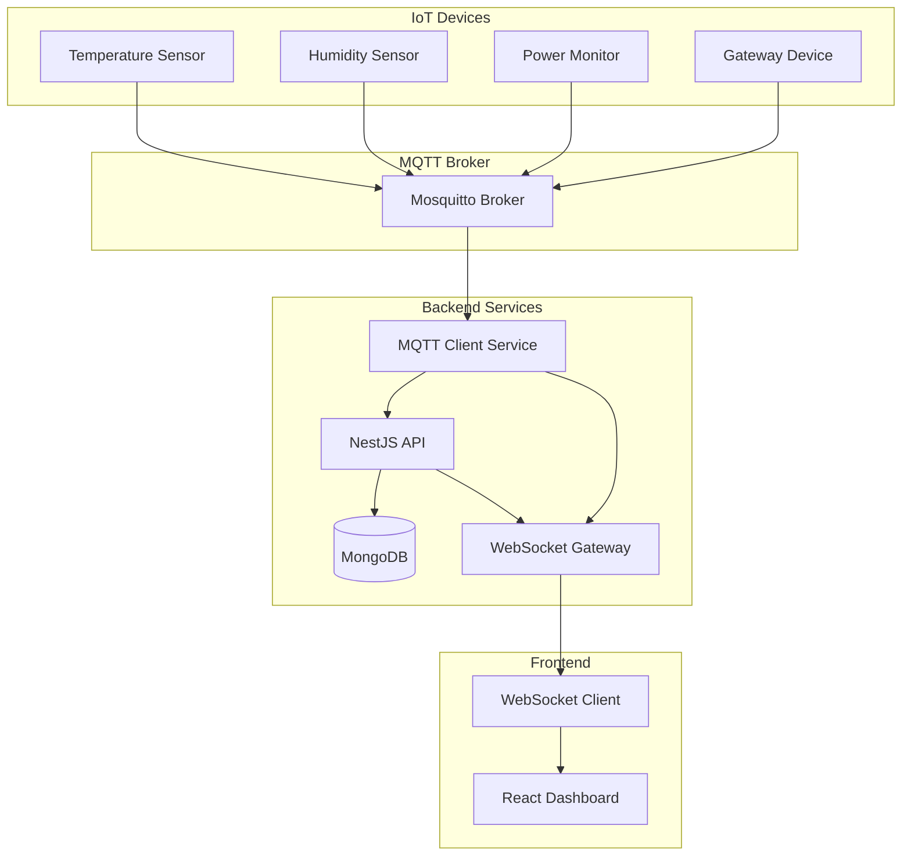

# IoT Real-time Dashboard

A comprehensive, scalable IoT monitoring system that provides real-time data visualization, alert management, and device monitoring capabilities. Built with modern technologies including NestJS, MongoDB, and MQTT for seamless IoT device integration.

## 🎯 What This System Does

This IoT dashboard allows you to:

- **Monitor IoT devices** in real-time with live data updates
- **Visualize sensor data** through interactive charts and graphs
- **Receive instant alerts** when devices exceed safety thresholds
- **Manage multiple devices** from a single, user-friendly interface
- **Track historical data** for trend analysis and reporting
- **Control access** with role-based user management

## 🚀 Quick Start Guide

### Prerequisites

Before you begin, ensure you have the following installed on your system:

- **Docker Desktop** - For running the application containers
- **Git** - For downloading the project files
- **Web Browser** - Chrome, Firefox, Safari, or Edge

### Step 1: Download the Project

1. Open your terminal or command prompt
2. Navigate to where you want to store the project
3. Run this command to download the project:
   ```bash
   git clone <repository-url>
   cd iot-realtime
   ```

### Step 2: Set Up Environment Configuration

1. Copy the example environment file:

   ```bash
   cp env.example .env
   ```

2. The system will use default settings, so no additional configuration is needed for initial setup.

### Step 3: Start the Application

1. Start all services with a single command:

   ```bash
   docker-compose up -d
   ```

2. Wait 2-3 minutes for all services to start up completely.

### Step 4: Access the Swagger

1. Open your web browser
2. Navigate to: `http://localhost:3000/docs`
3. You should see the IoT dashboard login page

### Step 5: Log In to the System

1. Use these default credentials to log in:

   **Admin Account (Full Access):**
   - Email: `admin@iot-dashboard.com`
   - Password: `admin123`

   **Regular User Account:**
   - Email: `user@iot-dashboard.com`
   - Password: `User@2525`

## 🔧 System Architecture

The system consists of several interconnected components:

System Overview Flow



## 🛠️ Technical Features

### Backend Capabilities

- **RESTful API**: Complete data management endpoints
- **GraphQL API**: Flexible data querying
- **WebSocket Gateway**: Real-time bidirectional communication
- **MQTT Integration**: Direct IoT device communication
- **JWT Authentication**: Secure user authentication
- **Role-based Access**: Admin and user permission levels
- **Data Validation**: Input sanitization and validation
- **Error Handling**: Comprehensive error management

### IoT Integration

- **MQTT Protocol**: Industry-standard IoT messaging
- **Device Simulator**: Test environment for development
- **Alert System**: Configurable threshold monitoring
- **Data Aggregation**: Historical data analysis
- **Device Management**: Centralized device control

## 📱 Supported Devices

The system can monitor various types of IoT devices:

- **Temperature Sensors**: Monitor environmental temperature
- **Humidity Sensors**: Track moisture levels
- **Power Monitors**: Measure electrical consumption
- **Gateway Devices**: Network connectivity hubs
- **Custom Sensors**: Extensible for additional sensor types

## 🔒 Security Features

- **Secure Authentication**: JWT-based token system
- **Password Protection**: Encrypted password storage
- **Role-based Access**: Different permission levels
- **Input Validation**: Protection against malicious data
- **CORS Protection**: Cross-origin request security
- **Rate Limiting**: Protection against abuse

## 🚨 Alert System

The system automatically monitors for:

- **Temperature Alerts**: When temperature exceeds safe limits
- **Humidity Alerts**: When moisture levels are too high or low
- **Power Alerts**: When electrical consumption is excessive
- **Device Offline**: When devices stop reporting data
- **System Health**: When system resources are low

## 📈 Data Management

### Real-time Data

- Live sensor readings updated every few seconds
- Instant alert notifications
- Real-time chart updates
- Live device status monitoring

### Historical Data

- Data retention for trend analysis
- Exportable reports and charts
- Configurable data retention periods
- Backup and recovery capabilities

## 🐳 Docker Deployment

The application uses Docker containers for easy deployment:

### Container Services

- **Backend**: NestJS API server
- **Frontend**: React web application
- **Database**: MongoDB data storage
- **MQTT Broker**: Mosquitto message broker
- **Simulator**: IoT device simulator for testing

### Management Commands

```bash
# Start all services
docker-compose up -d

# View running services
docker-compose ps

# View logs
docker-compose logs -f

# Stop all services
docker-compose down

# Restart services
docker-compose restart

# Update and rebuild
docker-compose up -d --build
```

## 🧪 Testing the System

### Using the MQTT Simulator

1. The system includes a built-in device simulator
2. It automatically generates realistic sensor data
3. You can see live data appearing in the dashboard
4. Test alerts by modifying simulator thresholds

### Manual Testing

1. **API Testing**: Use the built-in Swagger documentation at `http://localhost:3000/docs`
2. **GraphQL Testing**: Access the GraphQL playground at `http://localhost:3000/graphql`
3. **WebSocket Testing**: Real-time connections are automatically established

## 🔧 Configuration Options

### Environment Variables

Key configuration options in the `.env` file:

```env
# Application Settings
PORT=3000                    # Backend API port
NODE_ENV=development         # Environment mode

# Database Connection
MONGODB_URI=mongodb://...    # MongoDB connection string

# Security
JWT_SECRET=your-secret-key   # Authentication secret
JWT_EXPIRES_IN=24h          # Token expiration time

# MQTT Settings
MQTT_BROKER_URL=mqtt://...   # MQTT broker address
MQTT_CLIENT_ID=iot-dashboard # Client identifier

# WebSocket
WS_PORT=3001                # WebSocket port

# CORS
CORS_ORIGIN=http://localhost:3000  # Allowed origins
```

### Customizing Alerts

Alert thresholds can be configured in the system:

1. **Temperature Thresholds**: Set minimum and maximum temperature limits
2. **Humidity Thresholds**: Configure acceptable humidity ranges
3. **Power Thresholds**: Define maximum power consumption limits
4. **Notification Settings**: Configure alert delivery methods

## 📊 Monitoring and Analytics

### System Health

- **Service Status**: Monitor all system components
- **Performance Metrics**: Track system performance
- **Error Logging**: Comprehensive error tracking
- **Resource Usage**: Monitor CPU, memory, and disk usage

### Data Analytics

- **Trend Analysis**: Historical data patterns
- **Device Performance**: Individual device statistics
- **Alert History**: Track alert frequency and resolution
- **Usage Reports**: System utilization metrics
